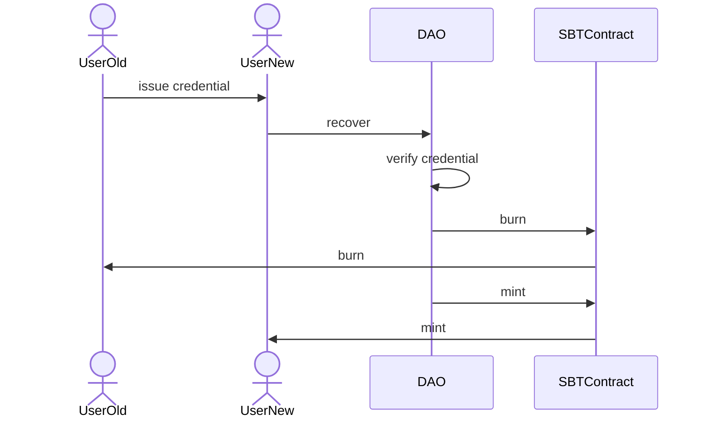
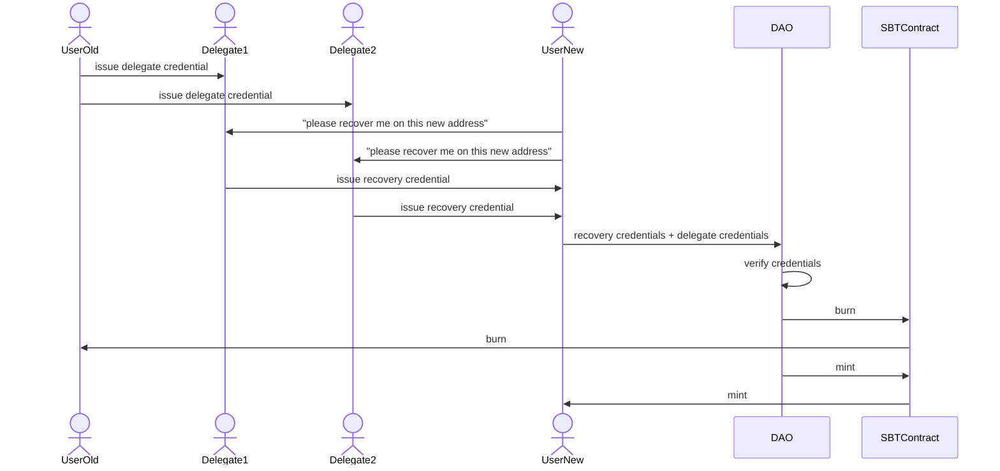

# SBT reputation recovery

This repo contains some sample-code for how a reputation system that uses SBTs could allow users to recover their
reputation in case they lose their original address.

The recovery mechanism presented use decentralized identifiers (DIDs) and Verifiable Credentials (VCs) managed by an
instance of Veramo.

I'm using DIDs to refer to the entities involved in these interactions. This should not be a problem since the
entities involved all have ethereum addresses (for their SBTs).
DIDs can be created for these addresses by prepending the string `did:ethr:`, or `did:pkh:eip155:1:` to the mainnet
addresses. `did:ethr` allows users to update their keys independently while `did:pkh` is always bound to the same key.

Veramo can also be instantiated in a frontend app and can use web3 wallets to sign verifiable credentials.

## Running the samples

before all, run

```
npm i
```

## 1. through user key rotation

```bash
npm run rotation
```

In this sample, the user is in control of their own keys and their ethereum address is treated as a DID (did:ethr) by
the system. They can freely rotate keys and their reputation still holds, attributed to the same original DID.

Proving control of a DID instead of a plain ethereum address involves signing a message(credential) in a similar fashion
to "Sign in with Ethereum". Verifying this credential involves resolving the DID and checking that the credential
signature was produced by one of the keys listed in the DID document.

## 2. through re-issuance

```bash
npm run reissuance
```

For users to rotate to a new address, they create a credential claiming ownership of a new address (DID) and the
platform re-mints equivalent tokens to the new address and burns the old ones.



The assumption is that the platform(`DAO`) retains the ability to burn user tokens in the `SBTContract` and that it will
only do so after a successful verification.
To a limited extent, the credentials can also be verified on-chain so that the token-burning ability need not be based
on authority but on a cryptographic verification, in case this becomes an issue.

A caveat of this system is that users must at some point be in control of both the old and new address when they create
the "SBTConnection" credential. This could be used to allow folks to deliberately migrate their reputation to more
secure wallets (like a Gnosis Safe), or to preemptively generate a recovery credential if they are already using
multiple wallets.

Another caveat is that such a recovery mechanism can mask a token transfer.

## 3. social recovery

```bash
npm run social
```

This is similar to the re-issuance flow, except that it involves issuing and verifying multiple credentials for the
platform to verify that the new address belongs to the same user and then initiate the mint/burn.

User creates one or more credentials naming some other addresses (DIDs) as their recovery delegates.
They can either share these credentials with their delegates (letting the delegates know that they are their recovery
partners) or keep them to themselves.

At the time of recovery, user generates a new address and asks their delegates to sign a credential that the old user
account should be recovered (reputation transfered to the new address).

The DAO verifies the delegation credentials along with the recovery credentials and if everything checks out re-mints
equivalent tokens to the new address and burns the old ones.



The user being recovered doesn't have to be the one intermediating these interactions. The only requirement is
that all the credentials are checked by the verifier. How they get there is not really relevant to the example.
In the code sample I embedded the delegation credentials in the recovery credentials. This is not a requirement for this
to work; credentials can be shared independently.

## Caveats

* This example of social recovery assumes that the delegates have the same address. If the delegates perform their own
  recovery in the meantime it complicates things a bit, but it is still possible.
* This example assumes that the delegate addresses correspond to externally owned accounts which can sign credentials.
  Delegating to smart contracts would also be possible when using DIDs, but the delegates would have to perform an
  additional step of declaring a signing key (this implies a transaction).
* For Verifiable Credentials to work in an interoperable fashion, their issuers should be DIDs, but the credential
  subjects don't have to be DIDs. The verifier can contain additional logic to figure out DIDs for delegates in case
  delegates are refferred to as usernames, handles, ENS names, emails, etc.
